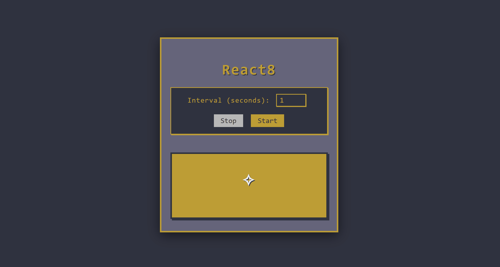

# React8 ⚡️

React8 is a **reaction and acceleration training tool** designed to sharpen your speed, agility, and response time.  
It challenges you to move in **8 directions** based on random cues that appear at customizable intervals.

Whether you’re an athlete, gamer, or just looking to boost your reflexes, React8 helps you train **anywhere, anytime**.

**Live Site:** [https://alex-gamero.github.io/React8/](https://alex-gamero.github.io/React8/) 

---

## 📷 Preview

---

## Features
- Random direction cues in 8 possible directions  
- Adjustable interval between cues (train at your own pace)  
- Mobile-friendly design — use it on your phone or computer  
- Simple and intuitive interface  

---

## How it works
1. Set the interval time in seconds.  
2. Press **Start**.  
3. Follow the direction that appears in the training box.  
4. Train your **acceleration, reaction time, and agility**.  

---

## 🛠️ Tech Stack
- **HTML5**  
- **CSS**  
- **JavaScript**  

---

## Coming Soon
- More training modes (reaction + memory + pattern drills)  
- Sound and vibration cues for extra challenge  
- Stats tracking (best time, average reaction)  
